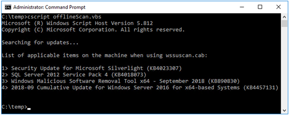

# What is Microsoft Baseline Security Analyzer and its uses?

Microsoft Baseline Security Analyzer (MBSA) is used to verify patch compliance. MBSA also performed several other security checks for Windows, IIS, and SQL Server. Unfortunately, the logic behind these extra checks hadn't been actively maintained since Windows XP and Windows Server 2003. Changes in the products since then rendered many of these security checks obsolete and some of their recommendations counterproductive.

MBSA was largely used in situations where Microsoft Update a local WSUS or Configuration Manager server wasn't available, or as a compliance tool to ensure that all security updates were deployed to a managed environment. While MBSA version 2.3 introduced support for Windows Server 2012 R2 and Windows 8.1, it has since been deprecated and no longer developed. MBSA 2.3 isn't updated to fully support Windows 10 and Windows Server 2016.

> [!NOTE]
> In accordance with our [SHA-1 deprecation initiative](https://aka.ms/sha1deprecation), the Wsusscn2.cab file is no longer dual-signed using both SHA-1 and the SHA-2 suite of hash algorithms (specifically SHA-256). This file is now signed using only SHA-256. Administrators who verify digital signatures on this file should now expect only single SHA-256 signatures. Starting with the August 2020 Wsusscn2.cab file, MBSA will return the following error "The catalog file is damaged or an invalid catalog." when attempting to scan using the offline scan file.

## Solution

A script can help you with an alternative to MBSA's patch-compliance checking:

- [Using WUA to Scan for Updates Offline](/windows/desktop/wua_sdk/using-wua-to-scan-for-updates-offline), which includes a sample .vbs script.
For a PowerShell alternative, see [Using WUA to Scan for Updates Offline with PowerShell](https://www.powershellgallery.com/packages/Scan-UpdatesOffline/1.0).

For example:

The preceding scripts use the [WSUS offline scan file](https://support.microsoft.com/help/927745/detailed-information-for-developers-who-use-the-windows-update-offline) (wsusscn2.cab) to perform a scan and get the same information on missing updates as MBSA supplied. MBSA also relied on the wsusscn2.cab to determine which updates were missing from a given system without connecting to any online service or server. The wsusscn2.cab file is still available and there are currently no plans to remove or replace it.
The wsusscn2.cab file contains the metadata of only security updates, update rollups and service packs available from Microsoft Update; it doesn't contain any information on non-security updates, tools or drivers.

## More information

For security compliance and for desktop/server hardening, we recommend the Microsoft Security Baselines and the Security Compliance Toolkit.

- [Windows security baselines](windows-security-baselines.md)
- [Download Microsoft Security Compliance Toolkit 1.0](https://www.microsoft.com/download/details.aspx?id=55319)
- [Microsoft Security Guidance blog](/archive/blogs/secguide/)