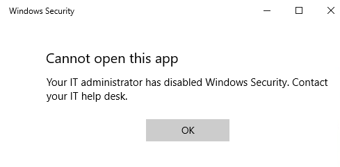

# Virus and threat protection

The **Virus & threat protection** section contains information and settings for antivirus protection from Microsoft Defender Antivirus and third-party AV products.

In Windows 10, version 1803, this section also contains information and settings for ransomware protection and recovery. These settings include Controlled folder access settings to prevent unknown apps from changing files in protected folders, plus Microsoft OneDrive configuration to help you recover from a ransomware attack. This area also notifies users and provides recovery instructions if there's a ransomware attack.

IT administrators and IT pros can get more configuration information from these articles:

- [Microsoft Defender Antivirus in the Windows Security app](/microsoft-365/security/defender-endpoint/microsoft-defender-security-center-antivirus)
- [Microsoft Defender Antivirus documentation library](/microsoft-365/security/defender-endpoint/microsoft-defender-antivirus-in-windows-10)
- [Protect important folders with Controlled folder access](/microsoft-365/security/defender-endpoint/controlled-folders)
- [Defend yourself from cybercrime with new Office 365 capabilities](https://blogs.office.com/2018/04/05/defend-yourself-from-cybercrime-with-new-office-365-capabilities/)
- [Microsoft Defender for Office 365](/microsoft-365/security/office-365-security/defender-for-office-365)
- [Ransomware detection and recovering your files](https://support.office.com/article/ransomware-detection-and-recovering-your-files-0d90ec50-6bfd-40f4-acc7-b8c12c73637f?ui=en-US&rs=en-US&ad=US)

You can hide the **Virus & threat protection** section or the **Ransomware protection** area from users of the machine. This option can be useful if you don't want employees in your organization to see or have access to user-configured options for these features.

## Hide the Virus & threat protection section

You can choose to hide the entire section by using Group Policy. The section won't appear on the home page of the Windows Security app, and its icon won't be shown on the navigation bar on the side of the app.

This section can be hidden only by using Group Policy.

> [!IMPORTANT]
> You must have Windows 10, version 1709 or later. The ADMX/ADML template files for earlier versions of Windows do not include these Group Policy settings.

1. On your Group Policy management machine, open the [Group Policy Management Console](/previous-versions/windows/it-pro/windows-server-2008-R2-and-2008/cc731212(v=ws.11)), right-click the Group Policy Object you want to configure and click **Edit**.
1. In **Group Policy Management Editor**, go to **Computer configuration** and click **Administrative templates**.
1. Expand the tree to **Windows components > Windows Security > Virus and threat protection**.
1. Open the **Hide the Virus and threat protection area** setting and set it to **Enabled**. Click **OK**.
1. [Deploy the updated GPO as you normally do](/windows/win32/srvnodes/group-policy).

> [!NOTE]
> If you hide all sections then the app will show a restricted interface, as in the following screenshot:
>
> 

## Hide the Ransomware protection area

You can choose to hide the **Ransomware protection** area by using Group Policy. The area won't appear on the **Virus & threat protection** section of the Windows Security app.

This area can be hidden only by using Group Policy.

> [!IMPORTANT]
> You must have Windows 10, version 1709 or later. The ADMX/ADML template files for earlier versions of Windows do not include these Group Policy settings.

1. On your Group Policy management machine, open the [Group Policy Management Console](/previous-versions/windows/it-pro/windows-server-2008-R2-and-2008/cc731212(v=ws.11)), right-click the Group Policy Object you want to configure and click **Edit**.
1. In **Group Policy Management Editor**, go to **Computer configuration** and click **Administrative templates**.
1. Expand the tree to **Windows components > Windows Security > Virus and threat protection**.
1. Open the **Hide the Ransomware data recovery area** setting and set it to **Enabled**. Click **OK**.
1. [Deploy the updated GPO as you normally do](/windows/win32/srvnodes/group-policy).
